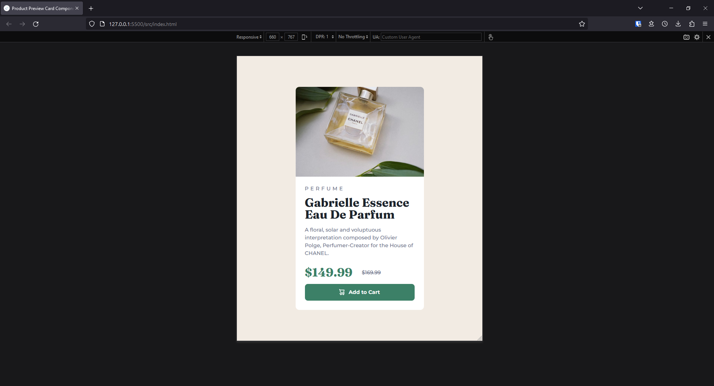
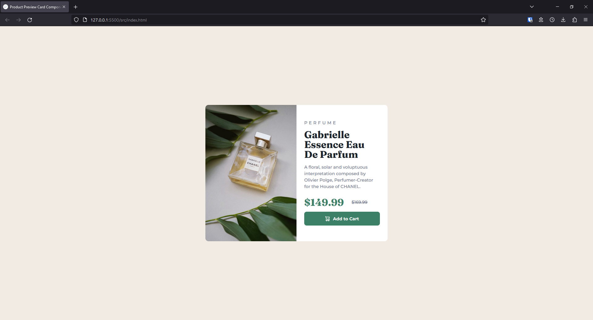

# Frontend Mentor - Product preview card component solution

This is a solution to the [Product preview card component challenge on Frontend Mentor](https://www.frontendmentor.io/challenges/product-preview-card-component-GO7UmttRfa). Frontend Mentor challenges help you improve your coding skills by building realistic projects. 

## Table of contents

- [Overview](#overview)
  - [The challenge](#the-challenge)
  - [Screenshot](#screenshots)
  - [Links](#links)
- [My process](#my-process)
  - [Built with](#built-with)
  - [Useful resources](#useful-resources)
- [Author](#author)
- [Acknowledgments](#acknowledgments)

## Overview

### The challenge

Users should be able to:

- View the optimal layout depending on their device's screen size
- See hover and focus states for interactive elements

### Screenshots

#### Mobile View

#### Desktop View

### Links

- [Solution URL](https://github.com/SuperSonic57/FEM_ProductPreviewCardComponent)
- [Live Site URL](https://supersonic57.github.io/FEM_ProductPreviewCardComponent/)

## My process

### Built with

- Semantic HTML5 markup
- SASS
- Flexbox
- CSS Grid
- SMACCS
- Mobile-first workflow

### Useful resources

- [SMACCS](https://smacss.com/) - Useful guide for structuring and organizing CSS/SASS files

## Author

- Frontend Mentor - [@SuperSonic57](https://www.frontendmentor.io/profile/SuperSonic57)

## Acknowledgments

- SASS reset derived from those created by Andy Bell and Kevin Powell.
- Technique for creating visually-hidden text created by Scott O'Hara
- Technique for changing image with media query created by Kevin Powell.
